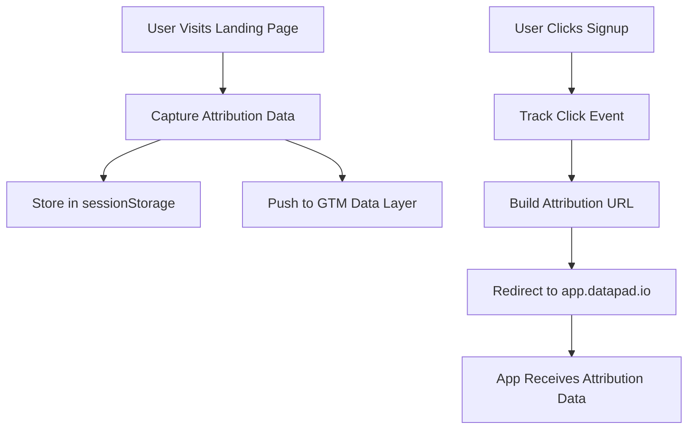

# Marketing Attribution Tracking System

A comprehensive marketing attribution system that tracks user journey from landing page (www.datapad.io) to app (app.datapad.io) using multiple methods for maximum reliability.

## 🎯 What It Tracks

### Core Attribution Data

- **Landing Page**: The first page user visited
- **Referrer Information**: Where the user came from
- **UTM Parameters**: Campaign tracking (source, medium, campaign, term, content)
- **User Agent**: Browser and device information
- **Session Data**: Unique session ID and timestamp
- **First Visit Detection**: Whether this is the user's first visit
- **Technical Details**: Browser language, screen resolution, timezone

## 🔧 How It Works

### 1. Multi-Method Approach

We use a **hybrid approach** combining three methods for maximum reliability:

1. **URL Parameters** (Primary): Industry standard for marketing attribution
2. **GTM Data Layer** (Analytics): Integrates with existing Google Tag Manager
3. **sessionStorage** (Fallback): Persists data across page refreshes

### 2. Attribution Flow



## 🚀 Implementation

### Automatic Setup ✅

The system is already integrated and working:

1. **Attribution Tracker**: Automatically captures data on page load
2. **Navigation Links**: All signup/signin buttons now include attribution
3. **Hero Section**: Primary CTAs track attribution
4. **GTM Integration**: Data flows to existing Google Tag Manager
5. **Debug Tools**: Development-only attribution inspector

### Key Components

#### 1. `marketing-attribution.ts`

Core library with all attribution functions:

- `captureAttributionData()`: Collects comprehensive attribution data
- `storeAttributionData()`: Stores data in sessionStorage + GTM
- `buildSignupUrl()`: Creates URLs with attribution parameters
- `trackSignupClick()`: Tracks click events

#### 2. `AttributionLink` Component

Smart link component that automatically:

- Appends attribution data to URLs
- Tracks click events
- Integrates with existing Button components

#### 3. `AttributionTracker` Component

Invisible component that:

- Initializes tracking on page load
- Captures and stores attribution data
- Pushes data to GTM data layer

## 🧪 Testing & Verification

### Development Debug Tool

In development mode, a debug panel shows:

- Current attribution data
- Referrer information
- UTM parameters
- Session details
- First visit status

**Access**: Bottom-right corner in development mode (expandable panel)

### Testing Scenarios

#### 1. Direct Visit

```
Landing: https://www.datapad.io/
Referrer: direct
UTM: none
```

#### 2. Campaign Visit

```
Landing: https://www.datapad.io/?utm_source=google&utm_medium=cpc&utm_campaign=launch
Referrer: google.com
UTM: source=google, medium=cpc, campaign=launch
```

#### 3. Social Media

```
Landing: https://www.datapad.io/features
Referrer: linkedin.com
UTM: varies by campaign
```

## 📊 Analytics Integration

### GTM Data Layer Events

#### `attribution_captured`

Fired when attribution data is first collected:

```javascript
{
  event: 'attribution_captured',
  landing_page: 'https://www.datapad.io/',
  referrer: 'https://google.com',
  referrer_domain: 'google.com',
  query_params: {
    utm_source: 'google',
    utm_medium: 'cpc',
    utm_campaign: 'launch',
    gclid: 'abc123',
    custom_param: 'xyz'
  },
  session_id: 'dp_1234567890_abc123',
  is_first_visit: true,
  is_first_touch: true
}
```

#### `signup_click`

Fired when user clicks any signup/CTA button:

```javascript
{
  event: 'signup_click',
  button_location: 'hero-primary',
  attribution_data: { /* full attribution object */ },
  landing_page: 'https://www.datapad.io/',
  referrer: 'https://google.com',
  referrer_domain: 'google.com',
  query_params: {
    utm_source: 'google',
    gclid: 'abc123'
  },
  session_id: 'dp_1234567890_abc123',
  is_first_visit: true,
  is_first_touch: true
}
```

#### `page_view_with_attribution`

Enhanced page view with attribution context:

```javascript
{
  event: 'page_view_with_attribution',
  page_title: 'Datapad - AI Data Analytics',
  page_url: 'https://www.datapad.io/',
  referrer: 'https://google.com',
  referrer_domain: 'google.com',
  query_params: {
    utm_source: 'google',
    utm_medium: 'cpc',
    gclid: 'abc123'
  },
  session_id: 'dp_1234567890_abc123',
  is_first_visit: true,
  is_first_touch: true
}
```

## 🔗 Attribution URL Structure

When users click signup, they're redirected with attribution parameters:

```
https://app.datapad.io/?landing_page=https%3A//www.datapad.io/&referrer=https%3A//google.com&referrer_domain=google.com&session_id=dp_1234567890_abc123&first_visit=true&utm_source=google&utm_medium=cpc&utm_campaign=launch
```

## 🛠 Configuration

### Environment Variables

Works with existing GTM setup:

```bash
NEXT_PUBLIC_GTM_ID=GTM-XXXXXXXXX
```

### Button Location Tracking

Each CTA has a unique `buttonLocation` identifier:

- `header-signin` / `header-signup`: Navigation buttons
- `mobile-signin` / `mobile-signup`: Mobile navigation
- `hero-primary` / `hero-demo`: Main hero section
- `feature-cta`: Feature page CTAs
- `pricing-cta`: Pricing page CTAs

## 🔒 Privacy & Compliance

### Data Collected

- **No PII**: No personal information collected
- **First-party data**: All data stays within Datapad domains
- **Session-based**: Data expires with browser session
- **Transparent**: All data visible in debug mode

### Cookie-Free

- Uses sessionStorage instead of cookies
- No GDPR cookie consent required for this data
- Compatible with Safari's privacy features

## 🚨 Troubleshooting

### Debug Panel Not Showing

- Only shows in development mode (`NODE_ENV=development`)
- Check browser console for any JavaScript errors

### Attribution Data Missing

- Ensure GTM is properly configured
- Check that `NEXT_PUBLIC_GTM_ID` is set
- Verify browser allows sessionStorage

### URLs Not Working

- Check that app.datapad.io can receive URL parameters
- Verify attribution data is being captured (use debug panel)

## 📈 Analytics Setup

### In Google Tag Manager

1. Create triggers for these custom events:

   - `attribution_captured`
   - `signup_click`
   - `page_view_with_attribution`

2. Set up variables to capture attribution data:

   - `{{attribution_data.landing_page}}`
   - `{{attribution_data.referrer}}`
   - `{{attribution_data.utm_source}}`
   - etc.

3. Forward data to your analytics platform (GA4, Facebook Pixel, etc.)

### In Google Analytics 4

Create custom parameters:

- `landing_page`
- `referrer_domain`
- `utm_source`
- `session_id`
- `is_first_visit`

## 🔄 Future Enhancements

Potential improvements:

1. **Server-side tracking**: More reliable cross-domain tracking
2. **Enhanced bot detection**: Filter out non-human traffic
3. **Attribution modeling**: Multi-touch attribution analysis
4. **A/B testing integration**: Track experiment variants
5. **Real-time dashboard**: Live attribution monitoring

## 💡 Why This Approach?

### Compared to Other Options:

#### ✅ URL Parameters + GTM + sessionStorage

- **Reliability**: Multiple fallback methods
- **Industry Standard**: Used by all major marketing tools
- **Privacy Compliant**: No cookies, no PII
- **Cross-domain**: Works across subdomains
- **Analytics Ready**: Integrates with existing GTM

#### ❌ Cookies Only

- Privacy concerns, requires consent
- Blocked by Safari and other browsers
- Size limitations

#### ❌ localStorage Only

- Doesn't work across subdomains
- Limited browser support in some contexts

#### ❌ GTM Data Layer Only

- Not persistent across page loads
- Depends on GTM implementation

## 📞 Support

For questions or issues:

1. Check the debug panel in development mode
2. Review GTM data layer in browser DevTools
3. Verify attribution URLs are being generated correctly
4. Test with different referrer scenarios

---

_This system provides enterprise-grade marketing attribution tracking while maintaining privacy compliance and reliability across different browsers and user scenarios._
